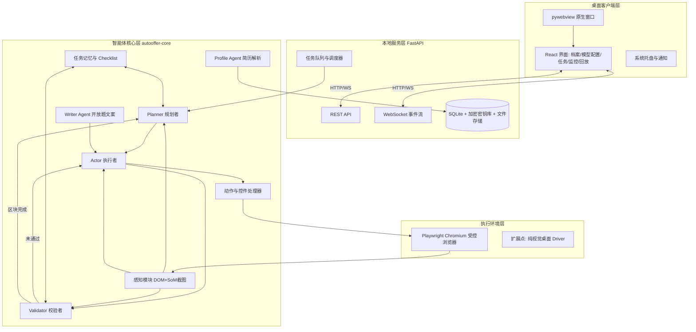
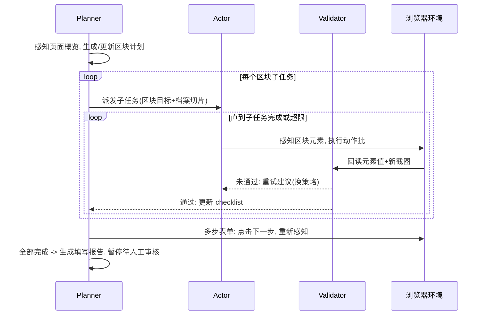
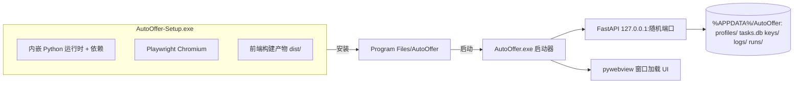

# AutoOffer 总体架构设计

| 项目 | 内容 |
| --- | --- |
| 文档版本 | v0.2 |
| 关联文档 | [01-需求规格说明书](01-需求规格说明书.md)、[03-详细设计](03-详细设计.md)、[04-开源方案调研](04-开源方案调研.md) |

## 1. 架构总览

系统分四层：桌面客户端层、本地服务层、智能体核心层、执行环境层。核心原则：

1. **Agent Core 与产品解耦**：智能体核心是独立 Python 包（`autooffer-core`），不依赖 FastAPI/界面，可单独 CLI 运行与测试。
2. **感知不依赖坐标定位**：以 DOM 结构化元素为一等公民、截图视觉为辅助证据，规避中小模型像素级 grounding 不稳的问题。
3. **多智能体职责分离**：Planner / Actor / Validator 三角色循环（Skyvern 2.0 在 WebVoyager 上验证该结构使成功率从 ~45% 提升至 85.85%），配合独立的 Profile Agent（简历解析）与 Writer Agent（开放题文案）。
4. **本地优先**：所有用户数据本机存储，服务仅监听 127.0.0.1。



## 2. 多智能体设计与任务拆分

### 2.1 角色定义

| 角色 | 职责 | 输入 | 输出 | 默认模型绑定 |
| --- | --- | --- | --- | --- |
| **Planner** | 任务拆分与进度管理：把整页/多步表单分解为区块级子任务（Section Task），维护全局 checklist；决定下一个执行的子任务；识别多步表单的推进时机；结合场景检测结果决策流程策略（登录转人工、简历优先流程切 `verify_and_fix` 核对模式、职位列表页找申请入口等，场景库见 01 §6） | 任务指令、页面概览（区块结构 + 场景标签 + 截图）、全局 checklist、历史摘要 | 子任务列表 / 下一子任务 / 推进指令 / 流程策略 / 完成判定 | 默认模型 |
| **Actor** | 子任务执行：在给定区块内决策具体动作序列（填写、点击、选择），一轮可批量输出多个互不影响的动作 | 子任务目标、区块内元素列表、截图、档案切片、最近动作历史 | 动作 JSON 列表 | 默认模型 |
| **Validator** | 结果校验：动作执行后回读元素实际值，与期望比对；判定子任务是否完成、是否需要重试或换策略 | 期望值、回读值、变化后截图 | 通过 / 重试建议 / 失败记录 | 默认模型（可绑定更小模型） |
| **Profile Agent** | 简历 PDF/Word → 结构化档案抽取；档案完整度评估 | 简历文本 | ProfileSchema JSON | 默认模型 |
| **Writer Agent** | 开放性问题回答生成（自我评价、"为什么选择我们"等），基于档案与问答知识库 | 问题、档案、知识库命中 | 文案 | 默认模型 |

角色与模型的绑定关系由模型配置中心的"角色路由"管理（FR-M3）：例如 Actor 用视觉模型、Validator 用更便宜的纯文本模型。

### 2.2 任务拆分机制（两级分解）

**第一级（Planner，区块级）**：感知模块提取页面的区块结构（`<fieldset>`、标题、分组容器），Planner 输出：

```json
{
  "sections": [
    {"id": "s1", "title": "基本信息", "fields_hint": ["姓名", "性别", "出生日期"], "status": "pending"},
    {"id": "s2", "title": "教育经历", "repeatable": true, "status": "pending"},
    {"id": "s3", "title": "实习经历", "repeatable": true, "status": "pending"},
    {"id": "s4", "title": "附件上传", "status": "pending"}
  ],
  "pagination": {"type": "multi_step", "next_button_hint": "下一步"}
}
```

**第二级（Actor，字段级）**：每个子任务内，Actor 只看到该区块的元素与对应的档案切片（如"教育经历"区块只注入 `profile.education`），显著缩短提示词、降低小模型出错率。

**执行循环**：



### 2.3 护栏与降级

- 全局护栏：最大步数（默认 60）、单任务 token 预算、单动作重试上限 3 次。
- 策略降级链（以日期控件为例）：直接键入 → 原生 fill → 日历面板导航 → 记入失败清单请求人工。
- 模型降级：视觉探测失败的端点自动切换纯 DOM 模式（不发送截图）。

## 3. 关键数据流

### 3.1 一次填写任务的生命周期

1. 用户在界面创建任务（URL + 选择档案 + 选项）→ REST API 入库，任务进入队列。
2. 调度器启动 Agent Runner（asyncio 任务），打开受控浏览器上下文（每任务独立 context）。
3. Planner–Actor–Validator 循环执行；每步产生 `AgentEvent`（动作、截图、模型输出摘要）写入 SQLite 并经 WebSocket 推送界面。
4. 触发暂停条件（登录墙/验证码/敏感动作/用户手动暂停）→ 任务置 `WAITING_HUMAN`，系统通知；用户处理后点击继续。
5. 完成 → 生成 `FillReport`（成功/失败/跳过/待确认字段清单）→ 任务置 `AWAITING_REVIEW`，浏览器窗口保留供用户审核提交。

### 3.2 档案数据流（按需注入）

简历文件 → 文本抽取（pypdf/python-docx）→ Profile Agent 结构化抽取（含获奖/语言/社团等扩展信息）→ 用户界面校对 + 引导式问卷补充主观信息（性格/爱好/家庭成员等）→ 本机档案库。

填表取值遵循**按需注入**三层链路（详见 03 §1.3）：字段目录常驻提示词（只有路径不含值）→ 区块切片按子任务预取 → `request_profile` 动作按字段补取。扩展信息"官网问到才提供"，restricted 级字段（身份证号等）触发人工授权；开放题经 Writer Agent 生成。

## 4. 部署与打包架构（软件形态）



- 启动器职责：选择空闲端口 → 启动本地服务（子进程或线程）→ 健康检查 → 打开 pywebview 窗口 → 退出时优雅关停服务与所有浏览器上下文。
- 打包：PyInstaller 生成应用目录，Inno Setup 制作安装程序；Chromium 随包分发（离线可装）。
- 备选方案（已评估未选）：Electron/Tauri 壳——引入第二运行时与 IPC 复杂度，对本项目收益有限；PySide6 原生 UI——界面开发效率低于 React 生态。

## 5. 技术选型与理由

| 决策点 | 选型 | 理由与备选 |
| --- | --- | --- |
| 浏览器控制 | Playwright（Python，Chromium，persistent context） | 反检测可后续换 patchright/系统 Chrome；备选 Selenium 生态老旧 |
| 感知策略 | DOM 元素编号为主 + SoM 标注截图为辅 | 30B 量化模型坐标 grounding 不可靠；纯视觉路线（Qwen-CUA 类）作为 Driver 扩展点保留 |
| LLM 接入 | `langchain-openai.ChatOpenAI`，OpenAI 兼容 | 与用户既有 vLLM 端点直接对接；结构化输出用 JSON mode + Pydantic 校验重试 |
| 多智能体框架 | 自研轻量状态机（不引入 LangGraph/AutoGen） | 循环拓扑简单固定，框架收益小于其复杂度与版本风险 |
| 服务框架 | FastAPI + Uvicorn | 类型友好、WebSocket 原生、自动 OpenAPI 文档 |
| 存储 | SQLite（SQLAlchemy 2.x）+ 文件系统 | 单机单用户，无需外部数据库；密钥用 Windows DPAPI（`keyring`） |
| 前端 | React 18 + TS + Vite + Ant Design | 组件成熟，表单/表格密集型界面开发效率高 |
| 桌面壳 | pywebview（Edge WebView2） | 单一 Python 运行时即可交付；Win10+ 自带 WebView2 |

## 6. 目录结构（monorepo）

```
auto_offer/
├── core/                          # autooffer-core 智能体核心（独立可用）
│   └── autooffer_core/
│       ├── agents/                # planner.py actor.py validator.py writer.py
│       ├── perception/            # dom_extractor.py som_annotator.py section_detector.py
│       │                          # scenario_detector.py scenario_rules.py (站点场景识别)
│       ├── actions/               # registry.py basic.py
│       ├── widgets/               # dropdown.py datepicker.py cascade.py upload.py richtext.py
│       ├── drivers/               # base.py playwright_driver.py  (扩展点: vision_desktop.py)
│       ├── llm/                   # client.py router.py schemas.py
│       ├── profile/               # schema.py parser.py resolver.py (按需注入)
│       ├── memory/                # checklist.py history.py
│       └── runner.py              # 任务执行入口(状态机)
├── server/                        # FastAPI 本地服务
│   └── autooffer_server/
│       ├── api/                   # routes: tasks profiles models system
│       ├── ws/                    # 事件推送
│       ├── db/                    # models.py repo.py
│       └── services/              # task_scheduler.py model_probe.py keystore.py
├── frontend/                      # React + TS + Vite
│   └── src/{pages,components,api,stores}/
├── app/                           # 桌面壳: launcher.py window.py
├── cli/                           # 命令行入口
├── tests/
│   ├── demo_forms/                # 基准表单集(验收)
│   ├── unit/  integration/  e2e/
├── scripts/                       # build_installer.py 等
├── docs/
└── pyproject.toml
```

## 7. 风险与对策

| 风险 | 影响 | 对策 |
| --- | --- | --- |
| 35B 量化模型指令遵循不稳，JSON 输出坏 | 循环卡死/误操作 | Pydantic 严格校验 + 自动修复重试（最多 2 次）+ vLLM guided JSON（`response_format`/`guided_json`） |
| 自定义控件千奇百怪，DOM 语义缺失 | 字段漏填错填 | SoM 截图交叉验证 + 控件处理器策略链 + Validator 回读兜底 + 失败清单透明化 |
| 网站反爬/自动化检测 | 被拦截 | persistent context + 系统 Chrome channel、人类化输入节奏；明确不做验证码破解，交人工 |
| 模型端点不支持视觉（用户自配） | 感知降级 | 探测后自动切纯 DOM 模式，界面明示能力差异 |
| 打包体积大（Chromium + Python） | 安装包 ~300MB | 可接受；提供不含 Chromium 的精简包（首启下载）作为 P2 |
