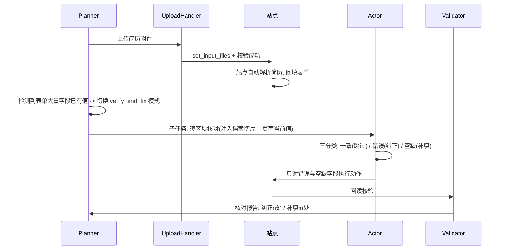
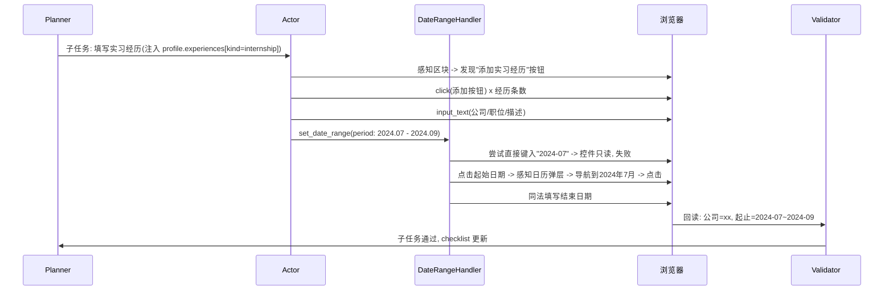

# AutoOffer 详细设计

| 项目 | 内容 |
| --- | --- |
| 文档版本 | v0.2 |
| 关联文档 | [02-总体架构设计](02-总体架构设计.md) |

本文按模块给出接口签名、数据模型与关键算法。代码示例为接口契约，实现时以此为准（变更需评审并更新本文）。

## 1. 档案模块（core/profile）

### 1.1 数据模型（Pydantic v2）

```python
class DateYM(BaseModel):
    year: int
    month: int | None = None
    day: int | None = None

class DateRange(BaseModel):
    start: DateYM
    end: DateYM | None = None          # None 表示"至今"

class Education(BaseModel):
    school: str
    major: str | None = None
    degree: Literal["高中", "大专", "本科", "硕士", "博士", "其他"] | None = None
    period: DateRange
    gpa: str | None = None
    description: str | None = None

class Experience(BaseModel):           # 实习/工作/项目通用
    kind: Literal["internship", "work", "project"]
    organization: str
    title: str | None = None
    period: DateRange
    description: str | None = None
    highlights: list[str] = []

class BasicInfo(BaseModel):
    name: str
    gender: Literal["男", "女", "其他"] | None = None
    birth_date: DateYM | None = None
    phone: str
    email: str
    native_place: str | None = None    # 籍贯
    current_city: str | None = None
    political_status: str | None = None
    id_number: str | None = None       # 加密存储, 默认不注入提示词, 命中相关字段时单独授权

class JobIntention(BaseModel):
    position: str | None = None
    city: list[str] = []
    salary_expectation: str | None = None
    available_date: DateYM | None = None

class QAPair(BaseModel):               # 问答知识库(FR-P5)
    question: str
    answer: str

# ---------- 扩展信息体系 (FR-P7): 官网常问但简历上通常没有 ----------

class LanguageSkill(BaseModel):
    language: str                      # 英语/日语/...
    level: str | None = None           # CET-4/CET-6/专八/N1/流利...
    score: str | None = None           # 雅思 7.0 / 托福 105 / 六级 560
    certificate_date: DateYM | None = None

class Award(BaseModel):
    title: str                         # 奖项名称
    level: str | None = None           # 国家级/省级/校级
    date: DateYM | None = None
    description: str | None = None

class CampusRole(BaseModel):           # 学生干部/社团经历
    organization: str
    role: str
    period: DateRange | None = None
    description: str | None = None

class FamilyMember(BaseModel):
    relation: str                      # 父亲/母亲/配偶...
    name: str
    workplace: str | None = None
    title: str | None = None
    phone: str | None = None

class Reference(BaseModel):            # 推荐人
    name: str
    relation: str                      # 导师/前直属上级...
    organization: str | None = None
    title: str | None = None
    phone: str | None = None
    email: str | None = None

class PersonalityInfo(BaseModel):
    traits: list[str] = []             # 性格特点关键词: 沉稳/外向/抗压...
    mbti: str | None = None
    assessment_summary: str | None = None   # 职业测评结果摘要
    hobbies: list[str] = []            # 兴趣爱好
    specialties: list[str] = []        # 特长: 钢琴/篮球/摄影...

class ExtendedInfo(BaseModel):
    personality: PersonalityInfo | None = None
    languages: list[LanguageSkill] = []
    awards: list[Award] = []
    campus_roles: list[CampusRole] = []
    family_members: list[FamilyMember] = []
    emergency_contact: FamilyMember | None = None
    marital_status: str | None = None
    height_cm: int | None = None
    weight_kg: int | None = None
    health_status: str | None = None
    party_join_date: DateYM | None = None      # 入党时间(政治面貌在 BasicInfo)
    hukou_location: str | None = None          # 户口所在地
    origin_place: str | None = None            # 生源地(校招常问)
    references: list[Reference] = []
    links: dict[str, str] = {}                 # {"github": url, "portfolio": url, ...}
    available_date: DateYM | None = None       # 期望到岗时间
    travel_willingness: str | None = None      # 是否接受出差/外派
    relocation_willingness: str | None = None  # 是否接受工作地点调剂

class AttachmentSpec(BaseModel):       # 站点对附件的要求(感知层解析所得)
    formats: list[str] = []            # ["pdf", "docx"]
    max_size_kb: int | None = None
    pixel_size: str | None = None      # 证件照 "295x413" 等

class Attachment(BaseModel):
    kind: Literal["resume", "photo", "transcript", "certificate", "portfolio", "other"]
    label: str                         # 用途标签: "中文简历" / "英文简历" / "一寸白底照"
    path: str                          # 本机绝对路径
    language: Literal["zh", "en"] | None = None
    meta: dict = {}                    # 像素尺寸/文件大小等缓存, 供上传前匹配 AttachmentSpec

class Profile(BaseModel):
    id: str
    label: str                         # 档案名称, 如"中文-算法岗"
    basic: BasicInfo
    intention: JobIntention | None = None
    education: list[Education] = []
    experiences: list[Experience] = []
    skills: list[str] = []
    certificates: list[str] = []
    self_evaluation: str | None = None
    extended: ExtendedInfo | None = None       # 扩展信息, 遵循按需注入(见 §1.3)
    qa_bank: list[QAPair] = []
    attachments: list[Attachment] = []
```

字段敏感级别标注（Pydantic `Field(json_schema_extra={"sensitivity": ...})`）：

| 级别 | 字段 | 注入策略 |
| --- | --- | --- |
| normal | 姓名/教育/经历/技能/爱好等 | 命中即注入 |
| sensitive | 家庭成员、婚姻状况、健康状况、身高体重、户口 | 命中才注入 + 填写报告中单独列出已使用项 |
| restricted | 身份证号、家庭成员电话 | 命中时暂停，界面单独授权本次使用 |

### 1.2 简历解析（Profile Agent）

```python
async def parse_resume(file_path: str, llm: LLMClient) -> tuple[Profile, list[str]]:
    """返回 (解析出的档案, 低置信字段列表)。低置信字段在 UI 高亮请用户确认。"""
```

- 文本抽取：PDF 用 `pypdf`（扫描件 P2 再考虑 OCR），Word 用 `python-docx`。
- 抽取策略：全文 + JSON Schema 注入提示词，`response_format=json`，Pydantic 校验失败带错误信息重试（≤2 次）。
- 扩展信息顺带抽取（FR-P9）：获奖、语言等级、社团经历等简历上常见的扩展字段一并抽入 `ExtendedInfo`；性格/爱好/家庭成员等简历上通常没有的字段留空，由界面的**引导式问卷**（可选填，按敏感级别分组，说明"哪类官网会用到"）补充。
- 敏感字段（身份证号）解析后立即进入加密存储，界面脱敏显示。

### 1.3 按需注入机制（FR-P8，核心设计）

原则：**表单不问，档案不给**。模型提示词中永远不出现整份档案，避免隐私外泄与 token 膨胀。

三层取值链路：

1. **字段目录（Field Catalog）**：档案序列化为一份紧凑目录（只有字段路径 + 一句话说明 + 是否有值，不含值本身），随 Actor 系统提示词常驻。例如：
   `extended.languages: 语言能力(2条: 英语CET-6, 日语N2) | extended.family_members: 家庭成员(3条) | extended.personality.hobbies: 兴趣爱好(有值)`
2. **区块切片（Section Slice）**：Planner 派发子任务时，按区块标题语义预取最可能用到的分组（教育经历区块 → `education`；家庭信息区块 → `extended.family_members`），值直接进入 Actor 提示词。
3. **动作级补取（request_profile）**：Actor 遇到切片外的字段（如"兴趣爱好"出现在基本信息区块里），输出 `request_profile` 动作声明字段路径，Runner 取值后在下一轮注入。restricted 级字段在此环节触发人工授权门禁。

```python
class ProfileResolver:
    def catalog(self, profile: Profile) -> str: ...                 # 字段目录文本
    def slice_for_section(self, profile: Profile, section: SectionInfo) -> dict: ...
    def resolve(self, profile: Profile, paths: list[str]) -> tuple[dict, list[str]]:
        """返回 (取到的值, 需人工授权的 restricted 路径)"""
```

表单问到但档案为空的字段：Actor 输出 `skip_field`（记入待确认清单），**禁止编造**；填写报告提示用户到档案中心补充后可重跑。

## 2. 感知模块（core/perception）

### 2.1 元素提取

注入 JS（单文件 `dom_extract.js`）遍历 DOM 与同源 iframe，产出：

```python
class UIElement(BaseModel):
    index: int                          # 本轮感知内唯一编号
    tag: str
    role: str                           # input/select/textarea/button/combobox/radio/checkbox/date/file/richtext/custom
    label: str                          # 关联 label > aria-label > placeholder > 邻近文本, 按优先级
    value: str                          # 当前值/已选项
    options: list[str] | None = None    # select 的选项(超过 30 条截断+标记)
    required: bool = False
    section_id: str | None = None       # 归属区块
    bbox: tuple[int, int, int, int]     # 视口坐标, 供 SoM 标注
    selector: str                       # 内部执行用稳定定位(优先 data-* / id / 结构路径), 不暴露给模型
    visible: bool
    frame_path: str | None = None       # iframe 链路

class PageObservation(BaseModel):
    url: str
    title: str
    sections: list[SectionInfo]         # 区块结构(标题/元素索引范围/是否可重复)
    elements: list[UIElement]
    screenshot_som: bytes | None        # SoM 标注截图(视觉模型可用时)
    scroll: dict                        # 当前视口/总高度
```

关键点：

- **label 归因算法**：`<label for>` → 包裹 label → `aria-labelledby/label` → placeholder → 同行左侧/上方最近文本节点（距离阈值 150px）。例外：通用提示语式占位符（"请输入/请选择/please…"）语义弱于旁边的可见字段名，降级到邻近文本之后。这是泛化准确率的决定因素，必须有独立单测集。
- **自定义控件识别启发式**：`role=combobox/listbox`、类名含 `select/picker/cascader/date`、只读 input + 点击弹层等，标记为 `custom`，由控件处理器接管。
- **区块识别**：`fieldset/legend`、标题标签（h2/h3）、卡片容器 + 语义聚类；输出供 Planner 做任务拆分。
- **长页面**：按视口分段滚动感知，元素去重合并。

### 2.2 SoM 截图标注

Pillow 在截图上为每个可交互元素画编号角标（颜色按 role 区分）。图片长边压到 1288px 以内（兼顾 token 与可读性）。纯 DOM 模式下跳过。

### 2.3 站点场景检测（FR-A15，需求 01 §6 场景库的实现载体）

`ScenarioDetector` 在每轮感知后输出页面场景标签，供 Planner 决策：

```python
class PageScenario(BaseModel):
    page_type: Literal["form", "login", "register", "job_list", "job_detail",
                       "preview", "success", "error", "unknown"]
    blocking_overlays: list[Literal["cookie_banner", "privacy_consent",
                                    "captcha", "qr_login", "generic_modal"]]
    signals: list[str]        # 命中的信号说明(审计用)
```

- 检测手段分两级：**启发式规则**（URL 关键词、密码框/验证码框存在、遮罩层 z-index 分析、"已投递"类提示文本）先行，规则不确定时由 Planner 结合截图裁决。规则集独立成 `scenario_rules.py`，可持续扩充且有专属单测夹具。
- 场景 → 策略映射（Runner 层）：`login/register/captcha/qr_login → WAITING_HUMAN`；`cookie_banner → 自动同意并记审计`；`privacy_consent → 涉第三方授权则暂停`；`job_list/job_detail → 定位申请入口子任务`；`success/重复投递提示 → 终止并报告`；会话超时（意外跳转到 login）→ 暂停恢复流程。
- **表单预填检测**：感知时统计已有值字段占比，超过阈值（40%）即提示 Planner 进入 `verify_and_fix` 模式（见 §3.4）——覆盖"上传简历自动解析回填"“历史数据带出”“草稿恢复”三种来源。

## 3. 动作与控件处理器（core/actions, core/widgets）

### 3.1 动作 Schema（模型输出契约）

```python
class Action(BaseModel):
    type: Literal["input_text", "click", "select_option", "set_date", "set_date_range",
                  "upload_file", "scroll", "press_key", "wait", "done", "ask_user",
                  "request_profile",    # 按需补取档案字段(见 §1.3)
                  "skip_field"]         # 档案无值, 记入待确认清单, 禁止编造
    element_index: int | None = None
    value: str | None = None            # input_text/select_option 的目标值
    date: DateYM | None = None
    date_range: DateRange | None = None
    attachment_label: str | None = None # upload_file: 引用档案附件的用途标签(如"中文简历")
    profile_paths: list[str] | None = None   # request_profile: 请求的字段路径
    reason: str                         # 一句话说明(审计用)
```

执行器把 `element_index` 映射回 `UIElement.selector` 执行。**模型永远不输出坐标与选择器**，只输出编号——这是对小模型最稳的接口。

### 3.2 控件处理器策略链

每类复杂控件一个 Handler，实现统一接口，内部按策略链降级：

```python
class WidgetHandler(Protocol):
    def match(self, el: UIElement) -> bool: ...
    async def fill(self, el: UIElement, target: Any, ctx: ExecContext) -> FillResult: ...
```

| Handler | 策略链（依次降级） |
| --- | --- |
| `DropdownHandler` | 原生 select_option → 点击展开→感知弹层→语义匹配选项点击 → 搜索式：键入关键词→等待过滤→选首个匹配 |
| `DatePickerHandler` | 按 placeholder 格式直接键入 → 原生 `fill`（`input[type=date/month]`）→ 日历面板导航：定位年月切换控件（`«/‹/›/»`、年月下拉）→ 点击目标日 → 失败记清单 |
| `DateRangeHandler` | 复用 DatePickerHandler 两次（起/止）；"至今"匹配复选框或选项 |
| `CascadeHandler` | 逐级：选省→等待市加载→选市→选区；档案地名标准化（"四川成都" → 四川省/成都市） |
| `UploadHandler` | 见 §3.4 上传全链路 |
| `RadioCheckHandler` | 按 label 语义匹配点击（含自定义 role） |
| `RichTextHandler` | contenteditable 聚焦后键入 → 常见编辑器（Quill/TinyMCE）API 注入 |

**选项语义匹配**：精确 → 归一化（去空格/全半角）→ 包含 → 由 Validator 模型二选一裁决（如档案"本科" vs 选项"统招本科/全日制本科"）。日期/学历/城市等维护小型同义映射表，但映射表只做加速，不做硬依赖。

### 3.3 执行安全

- 敏感按钮拦截：文本命中 `提交/确认投递/发送/支付/删除` 的 click 动作转为 `ask_user`（FR-A11）。
- 人类化节奏：输入按字符 30–80ms 随机间隔，动作间 300–800ms 随机停顿。

### 3.4 附件上传全链路（FR-A13/A16、FR-P10）

**上传入口识别**（三种形态，按序探测）：

1. 可见或隐藏的 `input[type=file]`（含 `display:none`/`opacity:0` 覆盖式）→ 直接 `set_input_files`。
2. 点击"上传"按钮触发系统文件选择器 → `page.expect_file_chooser()` 拦截后注入路径。
3. 拖拽上传区（dropzone）→ 构造 `DataTransfer` 派发 `drop` 事件。

**附件匹配**：感知层从上传控件的 `accept` 属性与周边提示文本解析出 `AttachmentSpec`（格式/大小/像素要求）→ 结合表单语言（FR-A17）与控件语义（简历/照片/成绩单）在档案附件中按 `kind + label + language + meta` 匹配最优附件；证件照超出像素/大小要求时 Pillow 等比压缩到达标（FR-A16），无法达标转 `ask_user`。

**上传结果校验**（Validator）：等待并确认成功信号——文件名回显、进度条完成、缩略图出现、"上传成功" toast；超时 30s 判失败进入重试（换入口形态）。

**站点解析核对模式（FR-A14）**：很多官网上传简历后会自动解析回填表单，此时 Planner 切换子任务类型为 `verify_and_fix`：



`verify_and_fix` 同样适用于：站点从历史投递带出的旧数据、草稿恢复后的续填。

## 4. LLM 接入（core/llm）

### 4.1 客户端与角色路由

```python
class ModelEndpoint(BaseModel):
    id: str
    name: str                           # 显示名
    base_url: str
    api_key: SecretStr                  # 落盘走 DPAPI 加密
    model: str
    temperature: float = 0.1
    max_tokens: int = 4096
    timeout_s: int = 600
    max_concurrency: int = 4
    extra_body: dict = {}               # 如 {"chat_template_kwargs": {"enable_thinking": false}}
    supports_vision: bool | None = None # 探测结果缓存

Role = Literal["planner", "actor", "validator", "profile_parser", "writer"]

class ModelRouter:
    def get(self, role: Role) -> LLMClient: ...   # 角色→端点, 未配置时回落默认端点
```

`LLMClient` 基于 `langchain_openai.ChatOpenAI` 封装，统一提供：结构化输出（Pydantic schema + 校验重试）、并发信号量、token 统计上报、多模态消息组装（截图 base64）。

### 4.2 能力探测（FR-M2）

```python
async def probe_endpoint(ep: ModelEndpoint) -> ProbeResult:
    # 1) GET /models 连通性  2) 最小对话  3) 1px 图片消息 → supports_vision
```

### 4.3 提示词组织（中文）

- 系统提示词按角色分文件置于 `core/autooffer_core/agents/prompts/`，模板变量用 Jinja2。
- Actor 提示词结构：任务目标 → 档案切片（JSON）→ 区块元素列表（紧凑文本表）→ 约束（只输出动作 JSON、不确定就 ask_user、不编造信息）→ 最近 5 轮动作与结果。
- 历史折叠：超过 5 轮的观察替换为一行摘要（"第 n 轮：填写了姓名、电话，校验通过"），控制上下文在 20k token 内。

## 5. 本地服务（server）

### 5.1 REST API（前缀 /api/v1）

| 方法 | 路径 | 说明 |
| --- | --- | --- |
| GET/POST/PUT/DELETE | `/profiles` `/profiles/{id}` | 档案 CRUD |
| POST | `/profiles/parse-resume` | 上传简历文件，返回解析档案与低置信字段 |
| GET/POST/PUT/DELETE | `/models` `/models/{id}` | 模型端点 CRUD（响应中 api_key 脱敏） |
| POST | `/models/{id}/probe` | 连通性与视觉能力探测 |
| GET/PUT | `/models/routing` | 角色路由配置 |
| POST | `/tasks` | 创建填写任务 `{url, profile_id, options}` |
| GET | `/tasks` `/tasks/{id}` | 任务列表/详情（含 FillReport） |
| POST | `/tasks/{id}/pause` `/resume` `/cancel` | 任务控制；`resume` 同时用于人工处理后继续 |
| GET | `/tasks/{id}/events` | 审计事件分页（回放数据源） |
| GET | `/system/health` `/system/version` | 健康与版本 |

### 5.2 WebSocket 事件（/ws/tasks/{id}）

```json
{"type": "step", "seq": 12, "agent": "actor", "summary": "填写 邮箱 = a@b.com", "screenshot_id": "..."}
{"type": "state", "value": "WAITING_HUMAN", "reason": "检测到登录页, 请手动登录后点击继续"}
{"type": "report", "data": { "filled": 28, "failed": 1, "skipped": 2, "pending_confirm": ["期望薪资"] }}
```

### 5.3 任务状态机

`QUEUED → RUNNING → (WAITING_HUMAN ⇄ RUNNING) → AWAITING_REVIEW → DONE / FAILED / CANCELLED`

调度器：asyncio 队列，全局并发上限默认 2（受模型端点 `max_concurrency` 约束）；每任务独立 Playwright persistent context（`%APPDATA%/AutoOffer/browser_profiles/{task_id}`）。

### 5.4 存储

- SQLite 表：`profiles`、`model_endpoints`、`model_routing`、`tasks`、`agent_events`（含截图文件引用）、`llm_usage`。
- 截图与附件存文件系统 `runs/{task_id}/`；密钥经 `keyring`（Windows Credential Manager/DPAPI）。

## 6. 前端页面（frontend）

| 页面 | 功能要点 |
| --- | --- |
| 首次引导 | 三步向导：模型配置（含探测反馈）→ 档案建立（上传或手填）→ 示例任务 |
| 档案中心 | 档案列表；结构化编辑器（经历卡片增删排序）；简历上传解析（低置信字段高亮）；扩展信息引导式问卷（按敏感级别分组、注明哪类官网会用到）；多附件管理（用途标签、规格自检）；问答知识库管理 |
| 字段授权 | restricted 级字段（身份证号等）被表单命中时的实时授权弹窗（本次使用/总是拒绝） |
| 模型配置 | 端点表格 + 编辑抽屉；探测按钮显示连通/视觉徽标；角色路由矩阵 |
| 任务 | 新建任务表单；任务卡片列表（状态/进度）；详情页：左侧实时截图流、右侧动作流水；暂停/继续/接管按钮；填写报告 |
| 回放 | 按事件序列步进回放截图与动作 |
| 设置 | 并发、浏览器可见性、语言、数据目录、检查更新 |

## 7. 桌面壳（app）

- `launcher.py`：找空闲端口 → 线程内起 Uvicorn → 轮询 `/system/health` → `webview.create_window(url)` → 窗口关闭钩子里优雅关停（取消运行中任务→关浏览器→停服务）。
- 单实例锁（命名互斥量）；崩溃日志写 `logs/crash/`。
- 打包脚本 `scripts/build_installer.py`：`npm run build` → PyInstaller（onedir）→ 复制 Chromium → Inno Setup 编译。

## 8. 关键序列图：填写"实习经历"区块（含日期区间）


