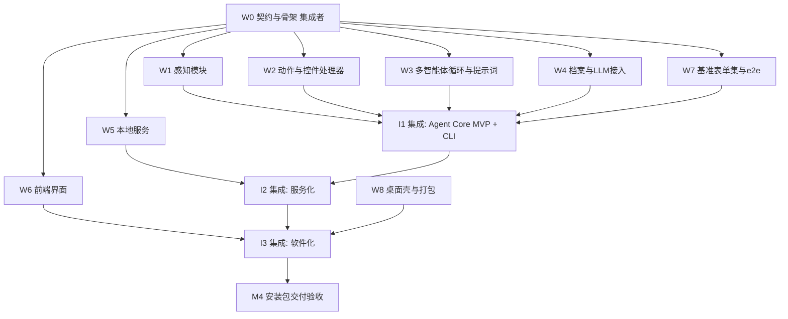

# AutoOffer 任务拆分与多子智能体并行开发计划

| 项目 | 内容 |
| --- | --- |
| 文档版本 | v0.2 |
| 开发模式 | 多子智能体（subagent）并行开发 + 集成者串行合入 |
| 前置条件 | 本文档与 01–05 号文档评审通过 |

## 1. 并行开发原则

1. **契约先行**：所有跨包依赖的数据模型与接口签名（[03-详细设计](03-详细设计.md) 中的 `Profile / UIElement / PageObservation / Action / ModelEndpoint / REST API`）在 W0 阶段先落地为代码骨架并冻结；子智能体只依赖契约，不依赖彼此的实现。
2. **目录即边界**：每个 Workstream 只允许写自己负责的目录 + 自己的测试目录，公共契约文件只有集成者可改。
3. **Mock 解耦**：契约包内为每个接口提供 mock/fake 实现（`FakeLLMClient`、`FakeDriver`、静态 HTML 夹具），子智能体不依赖真实模型端点即可自测。
4. **可验收再合入**：每个 Workstream 有明确的完成定义（DoD），CI 绿 + 集成者评审后合入 `main`。

## 2. Workstream 划分



### W0 契约与骨架（集成者，串行，先行完成）

- 建 monorepo 骨架（02 §6 目录结构）、`pyproject.toml`、CI、pre-commit。
- 落地全部契约模型与接口 Protocol（03 号文档），附 mock 实现与最小用例。
- 产出后打 tag `contracts-v1`，之后契约变更走集成者评审。

### W1–W8 并行工作包

| WS | 名称 | 负责目录 | 主要交付 | 关联需求 | 依赖 |
| --- | --- | --- | --- | --- | --- |
| W1 | 感知模块 | `core/.../perception/` | `dom_extract.js`、label 归因、区块识别、SoM 标注、iframe/滚动、场景检测器（规则集 + 表单预填检测） | FR-A1/A2/A9/A15 | W0 |
| W2 | 动作与控件处理器 | `core/.../actions/ widgets/ drivers/` | 动作执行器、7 类 WidgetHandler 策略链、附件上传全链路（三种入口 + 附件匹配 + 结果校验 + 图片压缩）、PlaywrightDriver、敏感动作门禁 | FR-A3/A4/A11/A13/A16 | W0 |
| W3 | 多智能体循环 | `core/.../agents/ memory/ runner.py` | Planner/Actor/Validator 状态机（用 FakeLLM+FakeDriver 测试）、场景→策略映射、`verify_and_fix` 核对模式、中文提示词、历史折叠、护栏 | FR-A2/A5/A6/A7/A8/A10/A12/A14/A15 | W0 |
| W4 | 档案与 LLM 接入 | `core/.../profile/ llm/` | Profile schema（含扩展信息体系）、简历解析、引导式问卷数据模型、ProfileResolver 按需注入（字段目录/区块切片/补取/敏感门禁）、多附件管理、问答知识库、ChatOpenAI 封装、角色路由、能力探测、结构化输出重试 | FR-P1~P10、FR-M1~M3、FR-A17 | W0 |
| W5 | 本地服务 | `server/` | REST + WS、任务队列与状态机、SQLite 存储、密钥库（DPAPI）、审计事件、restricted 字段授权流 | FR-T1~T5、FR-M4、FR-D3 | W0（接口可先用 core mock） |
| W6 | 前端界面 | `frontend/` | 六大页面（03 §6）、扩展信息问卷、附件管理、字段授权弹窗、OpenAPI 生成类型、WS 实时流；先以 MSW mock 后端开发 | FR-D2、各 UI 需求 | W0（OpenAPI 草案） |
| W7 | 基准表单集与 e2e | `tests/demo_forms/ tests/e2e/` | 5 个模拟简历页（01 §6.3：基础/复杂控件/多步动态/简历优先流程/中文官网风格）、字段正确率评测脚本 | NFR-1、验收 §4 | W0 |
| W8 | 桌面壳与打包 | `app/ scripts/` | launcher、pywebview 窗口、单实例、PyInstaller+Inno Setup 流水线 | FR-D1/D3/D5 | W5 完成后联调 |

> W7 与 W1/W2/W3 由**不同子智能体**承担，评测集与被评测代码隔离（防作弊，NFR-1）。

## 3. 集成阶段（集成者串行）

| 阶段 | 内容 | 验收（DoD） |
| --- | --- | --- |
| I1 Agent Core MVP | 合入 W1–W4 + W7，打通 CLI `fill` 全流程，真实端点跑基准表单集 | 简单页字段正确率 ≥ 90%；复杂控件页 ≥ 80%（迭代到 90%）；里程碑 M1 |
| I2 服务化 | 合入 W5，Runner 接入任务队列与事件流 | API 全量可用，WS 实时监控演示通过；里程碑 M2 |
| I3 软件化 | 合入 W6 + W8，前后端联调，打包 | 干净 Win11 虚拟机安装可用（验收 §4.3）；里程碑 M3/M4 |

## 4. 子智能体任务卡模板

派发给每个子智能体的任务说明必须包含：

```markdown
## 任务: <WS 编号与名称>
- 目标与关联需求: <FR/NFR 编号>
- 只允许修改的目录: <路径列表>
- 契约依赖: 参见 docs/03-详细设计.md §<节>, 契约代码位于 <路径>, 禁止修改契约
- 交付物: <代码 + 测试 + 包内 README>
- 完成定义(DoD):
  - [ ] 功能点清单逐项完成
  - [ ] 单测/集成测试通过, core 覆盖率 ≥ 80%
  - [ ] ruff + mypy 零告警
  - [ ] 不依赖真实模型端点即可运行测试(用 mock)
  - [ ] 遵守 docs/05-开发规范.md(日志脱敏/异常层次/提示词位置)
- 禁止事项: 修改契约与他人目录; 针对基准表单写死选择器; 提交真实个人信息
```

## 5. 冲突与变更管理

- **契约变更流程**：子智能体发现契约缺陷 → 在 PR 描述中提出变更提案（影响面 + 迁移方式）→ 集成者裁决并统一修改契约与 03 号文档 → 受影响 WS 同步适配。
- **合入顺序**：同批完成时按依赖序合入（感知/动作 → 循环 → 服务 → 前端）；集成者负责解决冲突，子智能体产出必须基于最新 `main` rebase。
- **进度追踪**：每个 WS 对应一个 GitHub Issue（或任务卡），状态流转 `待领取 → 进行中 → 待评审 → 已合入`。

## 6. 排期建议（以并行 4 个子智能体为例）

| 批次 | 并行内容 | 说明 |
| --- | --- | --- |
| 第 1 批 | W0（集成者独立完成） | 契约冻结是一切并行的前提 |
| 第 2 批 | W1 + W2 + W4 + W7 并行 | 纯 core 层，互不依赖 |
| 第 3 批 | W3 + W5 + W6 并行 | W3 依赖 W1/W2 合入后联调，前期用 mock 先行 |
| 第 4 批 | I1/I2 集成 + W8 并行 | 集成者跑真实端点调优提示词 |
| 第 5 批 | I3 集成与验收 | 安装包 + 真实站点抽测 |
